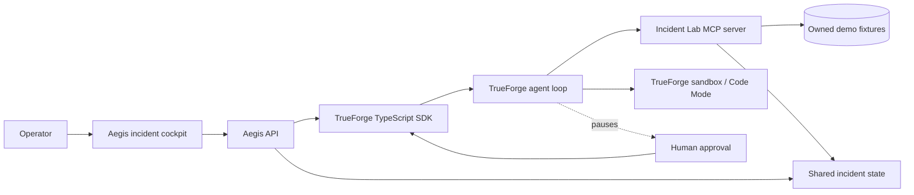

# Aegis

**Aegis is an approval-gated AI incident commander that investigates a checkout regression with MCP tools, runs a diagnostic in the TrueForge sandbox, and verifies a real rollback.**

## Problem

Incident response is repetitive under pressure: find the signal, correlate logs with a deploy, test the hypothesis, and decide whether a state-changing action is safe. An ordinary chatbot can summarize an incident, but it cannot prove that it used the operational systems or stop at the right safety boundary.

## Solution

Aegis runs one narrow, repeatable workflow against a local incident lab. The lab is deliberately degraded by deployment `8f31a2`. Aegis retrieves telemetry through a real MCP server, asks TrueForge to execute a read-only diagnostic in its sandbox, proposes a rollback, pauses for human approval, then calls the rollback tool and reads the recovered metrics.

The local lab is explicit demo infrastructure. It makes the workflow deterministic without pretending to have access to someone else's production systems.

## Architecture



## Agent Workflow

```text
incident visible
  -> get_incident
  -> get_metrics
  -> get_logs
  -> get_recent_deployments
  -> generated read-only diagnostic in TrueForge sandbox
  -> root cause and rollback proposal
  -> TrueForge tool.approval_required
  -> operator allow or deny
  -> rollback_deployment only after allow
  -> get_metrics verification
  -> RESOLVED only below the normal error-rate threshold
```

The cockpit is an event projection, not a scripted animation. Activity rows come from streamed TrueForge events. A run ends as `FAILED` if a tool, sandbox, or verification step fails.

## TrueForge Integration

The server creates an inline agent spec through `@truefoundry/trueforge-sdk` for each run. The spec enables:

- TrueForge session continuity across investigation and approval turns
- The `aegis-incident-lab` MCP connector
- TrueForge sandbox execution and Code Mode
- An explicit `requireApprovalForTools: ["rollback_deployment"]` policy
- A bounded 30-iteration agent loop
- Streamed turn events for the Aegis activity trace

TrueForge remains responsible for the model call, tool loop, sandbox provisioning, and approval pause. Aegis only projects those events and supplies the owned incident tools.

## MCP Tools

The incident lab intentionally exposes five tools:

| Tool | Access | Purpose |
| --- | --- | --- |
| `get_incident` | Read | Read incident status, severity, service, and failed deployment |
| `get_metrics` | Read | Read error rate, latency, success rate, and trend |
| `get_logs` | Read | Read bounded application logs |
| `get_recent_deployments` | Read | Read recent deployments and change summaries |
| `rollback_deployment` | State-changing | Restore the known-good deployment |

The MCP server marks the rollback as destructive. In addition, the Aegis process grants a short-lived, one-use approval token only after the UI submits an allow decision. A direct MCP rollback call is rejected even if it has valid arguments.

## Sandbox Architecture

The agent's instructions require TrueForge Code Mode for the diagnostic. The generated Python script calls read-only MCP tools through TrueForge's `mcp_client`, computes the log/error correlation in code, and prints a compact finding. The sandbox receives no model or MCP credentials and has no remediation capability.

TrueForge currently supports Daytona as its sandbox provider. A Daytona provider with snapshot creation permission is required for the live demo. The Aegis app does not implement a second, unsafe local code executor.

## Human Approval

The rollback request is not an Aegis UI convention. TrueForge pauses the turn with `tool.approval_required`. The backend extracts the pending tool call, displays the deployment, evidence, expected consequence, and reversibility, then resumes the same TrueForge session with `user.tool_approval`.

- `allow`: grants the one-use lab token and resumes TrueForge; the MCP rollback may execute.
- `deny`: resumes TrueForge with a denial; no lab token is granted and the incident remains open.
- Any rollback attempted without the token is rejected by the MCP tool.

## Setup

### Requirements

- Node.js 22.14 or newer
- A running TrueForge server
- A configured model provider in TrueForge
- A Daytona sandbox provider in TrueForge for Code Mode

### Install

```bash
npm install
cp .env.example .env
```

The repository contains no credentials. Keep provider keys in TrueForge settings or environment variables outside Git.

### Configure TrueForge

Start TrueForge in a separate terminal:

```bash
npx @truefoundry/trueforge@latest
```

For the OSS-only local demo, start Ollama and pull the tested model:

```bash
ollama serve
ollama pull qwen3:1.7b
```

In TrueForge, add a custom model provider named `ollama` with base URL `http://127.0.0.1:11434/v1` and model ID `qwen3:1.7b`. Expose it as the model FQN `ollama/qwen3-1.7b`. Configure the Daytona sandbox provider as well; the Daytona key needs permission to create snapshots. Verify the local model before starting Aegis:

```bash
npm run check:ollama
```

Then start Aegis:

```bash
npm run dev
```

In another terminal, while Aegis is running, register its MCP connector with the local TrueForge server:

```bash
npm run setup:trueforge
```

This uses the TrueForge settings API to create or replace only the named `aegis-incident-lab` remote connector. If TrueForge authentication is enabled, set `TRUEFORGE_TOKEN` to an admin ID token before running the command.

If TrueForge runs in Docker rather than on the host, set `TRUEFORGE_MCP_URL` to an address reachable from the container, such as `http://host.docker.internal:3000/mcp`, and use the equivalent Docker host networking configuration on Linux.

## Environment Variables

| Variable | Default | Description |
| --- | --- | --- |
| `HOST` | `127.0.0.1` | Aegis bind address; keep loopback for the local demo |
| `PORT` | `3000` | Aegis API and MCP port |
| `TRUEFORGE_BASE_URL` | `http://127.0.0.1:8791` | TrueForge HTTP API URL |
| `TRUEFORGE_TOKEN` | empty | Optional TrueForge bearer token |
| `TRUEFORGE_MODEL` | `ollama/qwen3-1.7b` | Configured OSS model FQN |
| `OLLAMA_BASE_URL` | `http://127.0.0.1:11434` | Local Ollama HTTP URL |
| `OLLAMA_MODEL` | `qwen3:1.7b` | Ollama model tag checked by `npm run check:ollama` |
| `TRUEFORGE_MCP_SERVER_NAME` | `aegis-incident-lab` | Connector name used in the agent spec |
| `TRUEFORGE_MCP_URL` | `http://localhost:3000/mcp` | MCP URL registered with TrueForge |
| `AEGIS_DEMO_DIR` | `./demo` | Owned fixture directory |

## Running Locally

```bash
npm run dev
```

Open [http://localhost:5173](http://localhost:5173). The API runs on port `3000`; Vite proxies `/api` requests during development. For a production-style local run:

```bash
npm run build
npm start
```

Then open [http://localhost:3000](http://localhost:3000).

## Running The Demo Incident

1. Open Aegis and confirm `INC-1042` shows an 18.4% checkout error rate.
2. Submit: `Investigate the checkout incident and fix it.`
3. Watch the actual TrueForge session, MCP calls, and sandbox event appear in the trace.
4. Read the root-cause finding: deployment `8f31a2` introduced a payment connection-pool regression.
5. Stop at the visible `Human approval required` panel.
6. Choose `Reject` to prove no rollback occurs. The incident stays open.
7. Choose `Run again`, repeat the investigation, and choose `Approve rollback`.
8. Watch `rollback_deployment` execute through MCP, followed by a fresh metrics read.
9. Confirm the error rate changes to 1.7% and the state becomes `RESOLVED`.

## Testing

```bash
npm run typecheck
npm run lint
npm test
npm run build
```

For live OSS verification, also run `npm run check:ollama`, reset the demo, and capture both an approval denial and an approved recovery. A valid recovery must show the Code Mode diagnostic, `rollback_deployment` for `8f31a2`, fresh metrics below the 2% threshold, and `RESOLVED`.

The local model is intentionally not treated as a scripted success path. During hardware validation, `qwen3:1.7b` reached the TrueForge sandbox but generated an invalid shell diagnostic against the current Daytona image, so Aegis correctly ended the run as `FAILED`. Do not present an OSS run as verified until the sandbox image and model produce the complete evidence chain above.

The tests cover fixture validation, read-only tool behavior, direct rollback denial, approval rejection, approved remediation, remediation failure, and verification failure. Live provider tests are intentionally not part of the deterministic test suite.

## Qodo Code Review Evidence

This repository was initialized locally as a greenfield project and does not yet have a GitHub remote or a merged pull request. No Qodo result is being claimed. Before submission, the owner must push this repository, open a substantive PR, run Qodo, address valid findings, and replace this paragraph with the real PR URL, review findings, fixes, any intentionally dismissed finding, and follow-up review evidence.

## AI Coding Assistant Disclosure

This project was developed with AI coding assistance. The owner is responsible for reviewing, understanding, testing, and demonstrating the implementation. No credentials or private production data were supplied to the repository.

## Known Limitations

- The incident lab contains one checkout scenario and is intentionally local and deterministic.
- TrueForge and a configured Daytona provider are required for the end-to-end agent run.
- Aegis has no authentication layer and should remain on a trusted local network for the demo.
- Incident state is held in process memory and resets when the API restarts.
- The current rollback approval binding is designed for the single-operator demo, not a multi-user production control plane.
- The OSS model path is hardware-sensitive on a 2 GiB GTX 1050. `qwen3:1.7b` is the intended local profile, but the complete Code Mode workflow must be verified on the presentation machine; Aegis fails closed if the model skips the diagnostic or proposes an invalid deployment.
