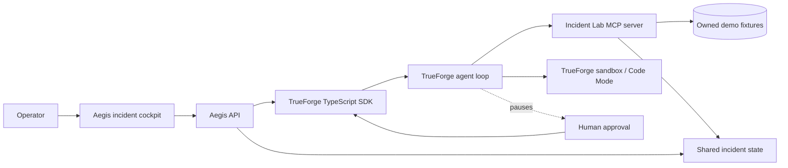

<h1 align="center">Aegis</h1>

<p align="center">
  <strong>Approval-gated AI incident commander.</strong><br/>
  Investigates a checkout regression with MCP tools, runs a diagnostic in the TrueForge sandbox, and verifies a real rollback — all with a human gate before anything irreversible happens.
</p>

<p align="center">
  <a href="https://github.com/hornley/aegis/actions"></a>
  
  
  
  <a href="https://github.com/hornley/aegis/pull/2"></a>
  <a href="LICENSE"></a>
</p>

<p align="center">
  <a href="https://github.com/hornley/aegis"><strong>GitHub</strong></a> &nbsp;&middot;&nbsp;
  <a href="https://github.com/hornley/aegis/pull/2"><strong>PR #2</strong></a> &nbsp;&middot;&nbsp;
  <a href="https://github.com/hornley/aegis/actions"><strong>CI</strong></a>
</p>

---

## About

**The problem.** A chatbot can summarize an incident, but it cannot act on one. Acting requires reaching real systems, running generated code safely, and stopping before anything irreversible happens — three things a chat window never needed.

**The solution.** Aegis runs one narrow, repeatable workflow against a local incident lab. A checkout service is failing at 18.4% error rate. The agent reads telemetry through MCP tools, generates a Python diagnostic that runs in an isolated TrueForge sandbox, proposes a rollback with evidence, pauses for human approval, and only then executes the rollback and verifies recovery via fresh metrics.

**The design.** Aegis fails closed. If the model skips the diagnostic or proposes the wrong deployment, the run ends rather than claiming unverified success. Recovery is verified only when the lab confirms the error rate dropped below the normal threshold.

**The harness.** TrueForge is the agent runtime: session continuity, MCP wiring, sandbox provisioning, approval boundary, bounded agent loop, and streamed events. Aegis supplies the incident-lab MCP tools and projects events into the cockpit.

---

## Architecture



---

## Agent Workflow

```text
incident visible
  -> get_incident
  -> get_metrics
  -> get_logs
  -> get_recent_deployments
  -> generated read-only diagnostic in TrueForge sandbox (Code Mode)
  -> root cause and rollback proposal
  -> TrueForge tool.approval_required  ← pauses here
  -> operator allow or deny
  -> rollback_deployment only after allow
  -> get_metrics verification
  -> RESOLVED only below the normal error-rate threshold
```

---

## How TrueForge Is Used

Aegis runs the entire agent on the TrueForge harness. The server creates an inline agent spec through `@truefoundry/trueforge-sdk` for each run, and TrueForge handles:

- **Session continuity** across investigation, approval, and verification turns
- **MCP connector wiring** — the `aegis-incident-lab` remote server
- **Sandbox provisioning** (Daytona) with **Code Mode** — generated Python runs with no credentials and no remediation capability
- **Approval boundary** — `tool.approval_required` genuinely pauses the turn; a human must approve or deny before the turn resumes
- **Bounded agent loop** — 30 iterations max, fail-closed on error
- **Streamed turn events** — the cockpit projects these into a live activity trace

TrueForge remains responsible for the model call, tool loop, sandbox, and human-in-the-loop pause. Aegis only supplies the incident tools and projects events.

---

## MCP Tools

| Tool | Access | Purpose |
|------|--------|---------|
| `get_incident` | Read | Read incident status, severity, service, and failed deployment |
| `get_metrics` | Read | Read error rate, latency, success rate, and trend |
| `get_logs` | Read | Read bounded application logs |
| `get_recent_deployments` | Read | Read recent deployments and change summaries |
| `rollback_deployment` | State-changing | Restore the known-good deployment |

The rollback is destructive by design. Aegis grants a short-lived, one-use approval token only after the UI submits an `allow` decision. A direct MCP rollback call is rejected even if it has valid arguments.

---

## Sandbox

The agent's instructions require TrueForge Code Mode for the diagnostic. The generated Python script calls read-only MCP tools through TrueForge's `mcp_client`, computes the log/error correlation in code, and prints a compact finding. The sandbox receives no model or MCP credentials and has no remediation capability.

### Fixed Sandbox Image

The default TrueForge sandbox image lacks `/usr/bin/bash` and `python3`. This repo includes a fixed image on GHCR:

```
ghcr.io/hornley/aegis/trueforge-sandbox-fixed:latest
```

Set `TRUEFORGE_SANDBOX_IMAGE` in TrueForge's environment to use it. See [BUILD.md](#) for the full build workflow.

---

## Human Approval

The rollback request is not an Aegis UI convention. TrueForge pauses the turn with `tool.approval_required`. The backend extracts the pending tool call, displays the deployment, evidence, expected consequence, and reversibility, then resumes the same TrueForge session with `user.tool_approval`.

- **`allow`** — grants the one-use lab token and resumes TrueForge; the MCP rollback may execute.
- **`deny`** — resumes TrueForge with a denial; no lab token is granted and the incident remains open.
- Any rollback attempted without the token is rejected by the MCP tool.

---

## Getting Started

### Prerequisites

- Node.js 22.14 or newer
- TrueForge running locally (`npx @truefoundry/trueforge@latest`)
- Ollama with `qwen3:1.7b` (`ollama pull qwen3:1.7b`)
- TrueForge Daytona sandbox provider configured

### Install and run

```bash
git clone git@github.com:hornley/aegis.git
cd aegis
npm install
cp .env.example .env
```

**Terminal 1 — Aegis**
```bash
npm run dev
```

**Terminal 2 — TrueForge**
```bash
npx @truefoundry/trueforge@latest
```

**Terminal 3 — Register the MCP connector**
```bash
npm run setup:trueforge
```

Open [http://localhost:5173](http://localhost:5173).

For production (single port):
```bash
npm run build
HOST=0.0.0.0 PORT=7878 TRUEFORGE_MCP_URL=http://localhost:7878/mcp npm start
```

Open `http://localhost:7878`.

### Run the demo

1. Open Aegis and confirm `INC-1042` shows an 18.4% checkout error rate.
2. Click **Start investigation**.
3. Watch MCP calls fire and the sandbox diagnostic run.
4. Stop at the **Human approval required** panel.
5. Click **Approve rollback** — watch it execute and verify at 1.7%.
6. State reaches **Resolved**.

---

## Testing

```bash
npm run typecheck
npm run lint
npm test
npm run build
```

16 tests pass covering: fixture validation, read-only tool behavior, direct rollback denial, approval rejection, approved remediation, remediation failure, verification failure, and cross-run isolation.

---

## Qodo Code Review Evidence

### PR #2: Fix cross-run verification

- **PR**: https://github.com/hornley/aegis/pull/2
- **Qodo finding**: The shared `verificationObserved` flag in `IncidentLab` meant one run's metrics read could resolve a different run's incident — a cross-run contamination bug.
- **Fix**: Added `lastRollbackRunId` tracking in `IncidentLab` and an `ownsRollback(runId)` check in `RunManager.handleTurnDone`. A run now resolves only when the lab confirms recovery **and** the run owns the rollback.
- **Regression test**: `prevents cross-run verification: one run rollback does not resolve another run`
- **Status**: All 16 tests pass, typecheck/lint clean, Qodo re-review complete.

---

## Known Limitations

- The incident lab contains one checkout scenario and is intentionally local and deterministic.
- TrueForge and a configured Daytona provider are required for the end-to-end agent run.
- Aegis has no authentication layer and should remain on a trusted local network.
- The OSS model path (`qwen3:1.7b`) is hardware-sensitive; Aegis fails closed if the model skips the diagnostic.

---

## License

[MIT](LICENSE)

## AI Coding Assistant Disclosure

This project was developed with AI coding assistance. The owner is responsible for reviewing, understanding, testing, and demonstrating the implementation. No credentials or private production data were supplied to the repository.
